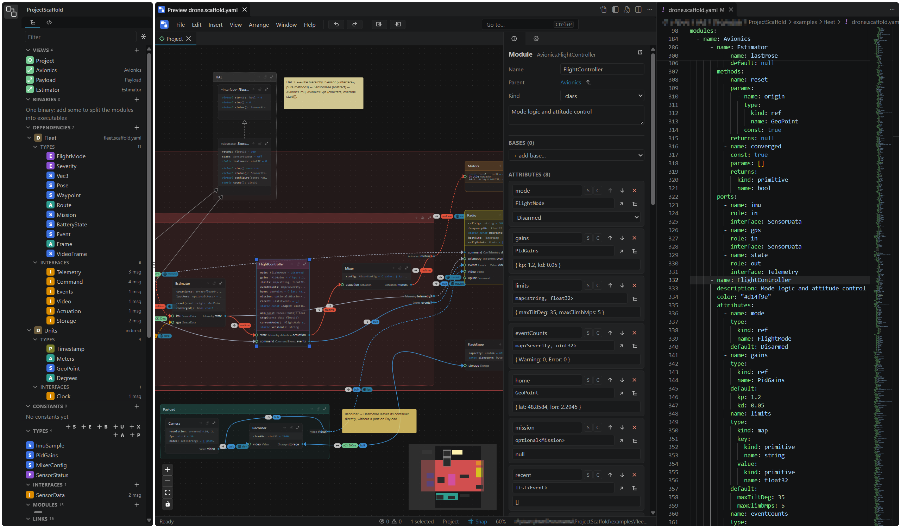

# VS Code

The extension opens `*.scaffold.yaml` / `.yml` / `.json` files as text, with an editable diagram preview beside them, like the Markdown preview. Its README, with the commands and settings tables: [`README.md`](../README.md). Building and installing it: [Building](building.md).

## Text and preview

- _Open Preview_: editor title, Ctrl+K V, or the explorer menu for any other YAML/JSON project file. The preview opens on the left of the text by default (`projectScaffold.preview.position`).
- The file stays a VS Code text document: dirty state, save, hot exit, git diff.
- The text cursor and the diagram selection follow each other (`projectScaffold.syncSelection`).
- Undo in the preview undoes the diagram's changes; undo in the text, the text's.
- While a diagram has the focus, its shortcuts win over VS Code's.

## Side bar and layouts

- The app's Explorer is the _ProjectScaffold_ side bar (activity bar), for the project file being edited; Settings is with the diagram's Inspector. Selecting there shows the entity in the diagram and the text.
- The side bar opens when a project file is first opened (`projectScaffold.views.revealOnOpen`) and with a preview (`projectScaffold.preview.showSideBar`).
- _Window › Full layout_, the editor title button or `projectScaffold.preview.layout` switch the preview to the _full_ layout, every tool docked in it like the web app, and back to the _integrated_ one.

## Code generation

Code is generated from the project files by [ProjectScaffold-Generator](https://github.com/MickaelBlet/ProjectScaffold-Generator) (command line), not by the extension.

## Integration

- Problems go to the VS Code Problems panel, on the line of their entity.
- The Output log (messages) also goes to the _ProjectScaffold_ output channel.
- The outline goes to the Outline view and the breadcrumbs of the text.
- Dependencies are refreshed from the files next to the document.
- With the theme setting _VS Code_ (the default), the colors are those of the VS Code color theme.
- IDL files open in VS Code's own editor.
- Workspace files are not opened: project files open one by one.
